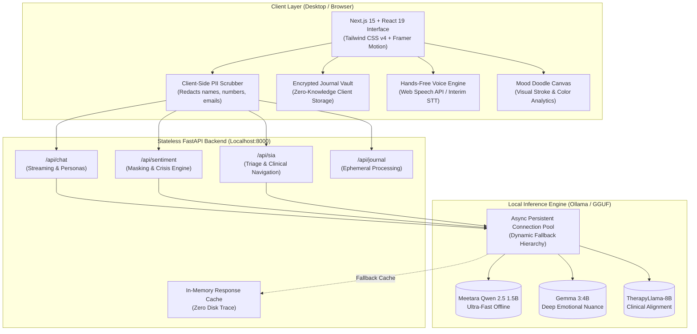

# ZenGuard AI
> **Privacy-First Mental Health Companion & Real-Time Sentiment Analytics Platform**

[](https://opensource.org/licenses/MIT)
[](https://www.python.org/)
[](https://fastapi.tiangolo.com/)
[](https://nextjs.org/)
[](https://react.dev/)
[](https://ollama.com/)
[](#zero-knowledge-privacy-architecture)

ZenGuard AI is a high-performance, edge-computing mental health and emotional well-being platform designed specifically for students and individuals navigating stress, anxiety, burnout, and emotional regulation. By executing local-first Large Language Models (LLMs) on-device via **Ollama**, ZenGuard AI delivers clinical-grade conversational support, emotional masking detection, and somatic grounding exercises with **absolute privacy**—no data ever leaves your computer.

---

## Core Pillars and Highlights

```
 ┌────────────────────────────────────────────────────────────────────────┐
 │                              ZenGuard AI                               │
 │                                                                        │
 │  100% Offline          Dynamic Model Tiers       57+ AI Personas       │
 │  No cloud dependencies   Meetara / Gemma / Llama    7-Tier Realism     │
 │                                                                        │
 │  Mood Doodle           Client-Side PII Scrub     Encrypted Vault       │
 │  Visual Sentiment Canvas   Zero-Trace Privacy        Local Key Lock    │
 └────────────────────────────────────────────────────────────────────────┘
```

- **Zero-Cloud Data Sovereignty**: All sentiment analysis and conversational inferences run locally on hardware via Ollama. No remote telemetry, no external API keys required.
- **Client-Side PII Scrubbing**: Names, addresses, emails, phone numbers, and identifying tokens are redacted in the client layer before reaching inference.
- **Dynamic Multi-Model Switching**: Seamlessly toggle between local AI brains (`Meetara Qwen-2.5 1.5B`, `Google Gemma 3:4B`, `TherapyLlama-8B`, `Llama 3.2`) directly from the chat interface.
- **57+ Verified Behavioral Personas**: Structured across a 7-tier psychological and conversational framework (Stoics, Empathetic Companions, Academic Mentors, Family Archetypes).
- **Multimodal Emotional Canvas**: "Mood Doodle" allows non-verbal emotional expression; drawing dynamics and color palettes are converted into sentiment cues.
- **Zero-Knowledge Journal Vault**: Private, client-side encrypted reflections protected with biometric or local passphrase locking.
- **Clinical Safety Protocols**: Real-time crisis sentiment triage with immediate escalation to verified global helpline directories.

---

## System Architecture



---

## Quick Start (Automated and Manual)

### Option 1: Automated 1-Click Launch (Recommended)

ZenGuard AI includes self-contained bootstrap wizards that automatically detect, install missing dependencies via package managers, and launch all services.

#### Windows
```powershell
# 1. Run the automated installer wizard (installs Node, Python, Ollama, dependencies)
install.bat

# 2. Launch the entire application with one click
start.bat
```

#### Linux and macOS
```bash
chmod +x install.sh start.sh
./install.sh
./start.sh
```

---

### Option 2: Manual Developer Setup

#### 1. Prerequisites
Ensure you have the following installed:
- **[Ollama](https://ollama.com/)**
- **[Python 3.10+](https://www.python.org/downloads/)**
- **[Node.js 18+](https://nodejs.org/)** & `npm`

#### 2. Pull Local AI Models
Download one or more supported models via Ollama:
```bash
# Recommended for standard setups:
ollama pull gemma3:4b

# Lightweight option for lower-spec laptops:
ollama pull llama3.2:1b

# Alternative high-speed model:
ollama pull qwen2.5:1.5b
```

#### 3. Backend Setup (FastAPI)
```bash
cd backend

# Create & activate Python virtual environment
python -m venv venv

# Windows:
venv\Scripts\activate
# Linux/macOS:
source venv/bin/activate

# Install dependencies
pip install -r requirements.txt

# Start FastAPI server on port 8000
python -m uvicorn main:app --reload --port 8000
```
*Backend runs at: `http://127.0.0.1:8000` (API Docs at `http://127.0.0.1:8000/docs` in debug mode).*

#### 4. Frontend Setup (Next.js 15)
Open a new terminal window:
```bash
cd frontend

# Install Node packages
npm install

# Start Next.js development server
npm run dev
```
*Open your browser at `http://localhost:3000` (or `http://localhost:3500`).*

#### 5. Native Desktop App (Optional via Electron)
```bash
cd frontend
# Run in Electron desktop window
npm run electron:dev
```

---

## Local AI Models and Fallback Architecture

ZenGuard AI features an automated **4-Tier Resilient Inference Hierarchy**:

```
Tier 1: Selected Local Model (e.g. Meetara / Gemma 3:4B / TherapyLlama)
   │ (if model not pulled or busy)
   ▼
Tier 2: Auto-Resolved Local Model (Discovers any available Ollama model on port 11434)
   │ (if Ollama offline or unresponsive)
   ▼
Tier 3: In-Memory Response Cache (Zero-disk, ephemeral deterministic cache)
   │ (if cache miss)
   ▼
Tier 4: Offline Clinical Rule-Based Grounding Engine (Guarantees 100% uptime)
```

### Supported Models in Chat Interface
| Model Badge | Model Name | Primary Use Case | Speed / VRAM |
| :--- | :--- | :--- | :--- |
| **Meetara Fast** | `meetara-qwen2.5-1.5b` | Instant companion chat, mobile/laptop friendly | Ultra-fast (~1.5GB VRAM) |
| **Gemma 3** | `gemma3:4b` | Deep emotional nuance, chain-of-thought `<think>` | Balanced (~3.5GB VRAM) |
| **TherapyLlama** | `therapyllama:latest` | Specialized supportive dialogue, clinical grounding | High precision (~5.5GB VRAM) |
| **Llama 3.2** | `llama3.2:latest` | Concise everyday companion interaction | Fast (~2.0GB VRAM) |

---

## Zero-Knowledge Privacy Architecture

ZenGuard AI was built from first principles around digital sovereignty:

1. **Client-Side PII Scrubbing**: Names, dates, addresses, phone numbers, and identifiers are stripped in the browser before payload transmission.
2. **Stateless Operations**: The backend has zero database drivers, no SQLite, no PostgreSQL, and no cloud object storage. Every request is processed ephemerally in RAM and released.
3. **Zero Request Body Logging**: Standard HTTP request logging (`uvicorn.access`) is explicitly disabled in [main.py](file:///d:/ALL%20OF%20US/PRINCE/coding/hackathon%20projects/neuralx%20health/backend/main.py) to prevent accidental persistence of personal thoughts.
4. **Anti-Reconnaissance Global Exception Handler**: Prevents server stack trace leaks or debug metadata exposure.
5. **Client-Side Encrypted Journal Vault**: Journal entries are encrypted in the user's browser with zero cloud sync.

---

## Project Organization

```
neuralx health/
├── backend/
│   ├── models/             # Pydantic schemas (Sentiment, Chat, SIA)
│   ├── privacy/            # PII detection & anonymization helpers
│   ├── routers/
│   │   ├── chat.py         # Multi-model chat & streaming completions
│   │   ├── sentiment.py    # Sentiment & emotional masking analytics
│   │   ├── sia.py          # Sia AI triage navigator
│   │   ├── journal.py      # Ephemeral journal processing
│   │   └── translate.py    # Multilingual translation service
│   ├── services/
│   │   ├── ollama_client.py# Resilient persistent Ollama connection pool
│   │   ├── knowledge_base.py# Clinical guidelines & intervention strategies
│   │   └── response_cache.py# Ephemeral RAM cache
│   ├── prompts.py          # 57+ Persona behavioral prompts & system templates
│   ├── main.py             # FastAPI entrypoint & privacy configuration
│   └── requirements.txt    # Python dependencies
├── frontend/
│   ├── src/
│   │   ├── app/            # Next.js App Router (pages & layout)
│   │   ├── components/     # React 19 UI component library
│   │   │   ├── ChatInterface.tsx      # Multi-model chat interface
│   │   │   ├── MoodDoodleCanvas.tsx   # Multimodal doodle analysis
│   │   │   ├── JournalVaultLock.tsx   # Zero-knowledge journal vault
│   │   │   ├── BreathingExercise.tsx  # Interactive somatic exercises
│   │   │   ├── GroundingExercise.tsx  # 5-4-3-2-1 Grounding tool
│   │   │   ├── SiaAssistant.tsx       # Sia triage assistant
│   │   │   └── VoiceInput.tsx         # Voice STT interaction
│   │   └── lib/            # Client-side API orchestration & helpers
│   └── package.json        # Frontend dependencies
├── electron/               # Native desktop wrapper (Electron)
├── install.bat / start.bat # Windows 1-click bootstrap scripts
├── install.sh / start.sh   # Unix 1-click bootstrap scripts
├── PERSONA_REGISTRY.md     # Detailed documentation of all 57 personalities
└── .gitignore              # Clean ignore rules (skills, agents, weights excluded)
```

---

## REST API Reference

| Method | Endpoint | Description |
| :--- | :--- | :--- |
| `GET` | `/health` | Health check with Ollama status and resolved model tier |
| `POST` | `/api/chat` | Send message to selected persona; supports custom model selection |
| `POST` | `/api/sentiment/analyze` | Real-time sentiment score & emotional masking indicator |
| `POST` | `/api/sentiment/doodle` | Multimodal analysis of user canvas drawing & color mood |
| `POST` | `/api/sia/triage` | Sia intelligent clinical triage & resource recommendation |
| `GET` | `/api/cache/stats` | Ephemeral response cache hit/miss statistics |
| `POST` | `/api/cache/clear` | Purge in-memory response cache |

---

## Verification and Quality Standards

- **Type Safety**: Frontend passes `tsc --noEmit` with zero errors.
- **Python Syntax**: All routers, services, and schemas compiled with zero syntax or runtime import discrepancies.
- **Dependency Integrity**: 100% free, open-source, and self-hosted libraries. Zero paid APIs or vendor lock-in.

---

## License
Distributed under the **MIT License**. See `LICENSE` for details.

---
*ZenGuard AI — Transforming emotional well-being through edge computing, open models, and uncompromising privacy.*
